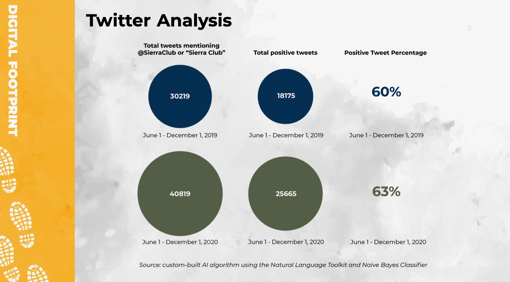

# sierra-club-sentiment

resources: 

https://en.wikipedia.org/wiki/Naive_Bayes_classifier

https://www.nltk.org

https://www.youtube.com/watch?v=O2L2Uv9pdDA

https://www.digitalocean.com/community/tutorials/how-to-work-with-language-data-in-python-3-using-the-natural-language-toolkit-nltk

https://github.com/twintproject/twint
